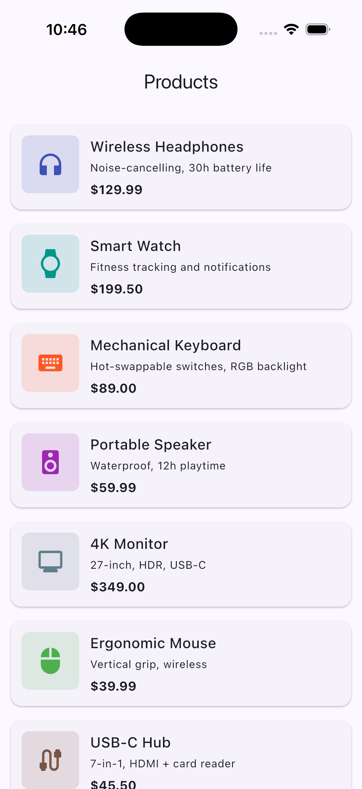
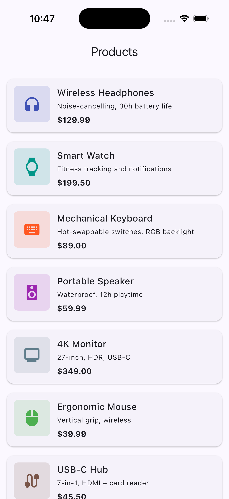
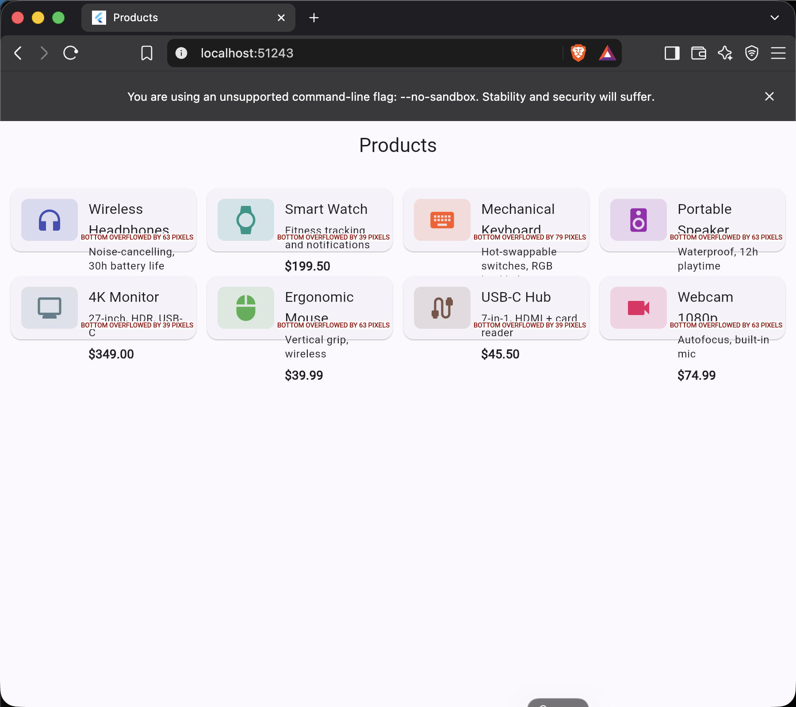
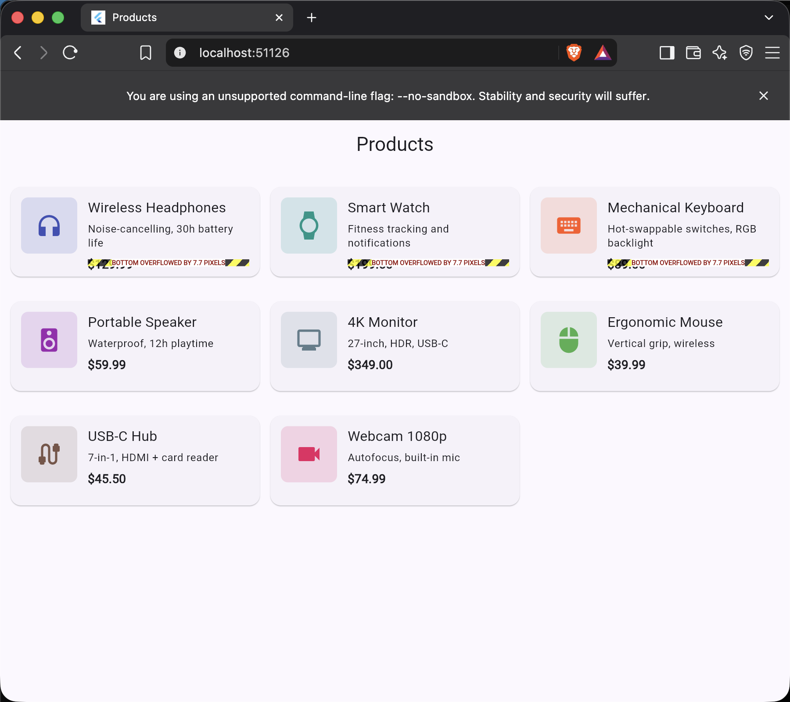

# Agent Skills en Flutter — ¿de verdad cambian el resultado?

Un experimento controlado para medir cuánto cambia el código que produce un
agente de IA cuando le instalas un **Agent Skill**, comparado con el mismo agente
sin él.

La tarea es la misma en ambos casos: volver responsiva una pantalla de catálogo
de productos. La única variable que cambia es la presencia del skill oficial
[`flutter-build-responsive-layout`](https://github.com/flutter/agent-plugins).

El resultado se compara en tres niveles: **código**, **árbol de widgets** (real,
capturado de la app corriendo vía el Dart & Flutter MCP server) y **resultado
visual** (capturas en móvil y en web ancho).

---

## TL;DR

- En pantalla **angosta** (móvil), las dos versiones se ven idénticas.
- En pantalla **ancha** (~900px), la versión **sin skill** desborda hasta
  **79 px** y corta el nombre de los productos; la versión **con skill** desborda
  **7.7 px** y no corta nada.
- Contra los 6 criterios que documenta el propio skill: **sin skill 1/6**,
  **con skill 6/6**.
- La causa, confirmada en el árbol de widgets: solo la versión con skill envuelve
  el layout en un `LayoutBuilder` y adapta el ancho de columna al contenido.

---

## Cómo está organizado el repo

El experimento vive en tres ramas para que cada toma sea reproducible desde el
mismo punto de partida:

| Rama | Qué contiene |
|---|---|
| `main` | El baseline no responsivo + este README + toda la evidencia. La portada. |
| `without-skill` | Baseline + el `main.dart` de la **Toma A** (agente base, sin skill). |
| `with-skill` | Baseline + el `main.dart` de la **Toma B** (agente con el skill). |

La evidencia completa (scorecards, árboles de widgets, capturas) está en
[`evidence/`](evidence/) — `evidence/toma-A/` para la Toma A (sin skill) y
`evidence/toma-B/` para la Toma B (con skill).

---

## El experimento, paso a paso

1. Se parte de un catálogo de productos **sin responsividad**: un `ListView`
   plano de tarjetas, igual en cualquier tamaño de pantalla.
2. **Toma A:** se le pide al agente base (sin skill) que haga la pantalla
   responsiva — lista en móvil, grilla en pantallas anchas.
3. Se resetea al baseline, sin dejar rastro del intento anterior.
4. Se instala el skill `flutter-build-responsive-layout`.
5. **Toma B:** se le da al agente **exactamente el mismo prompt** que en la Toma A.
6. Se conecta el Dart & Flutter MCP server a cada build corriendo (simulador iOS
   y Flutter Web) para capturar el árbol de widgets real y las pantallas.

> El prompt es idéntico palabra por palabra en ambas tomas. La única variable es
> el skill.

---

## Qué es (y qué no es) un Agent Skill

Para leer bien este experimento conviene tener claro esto:

- Un **Agent Skill** es un archivo de texto (`SKILL.md`) con instrucciones y
  ejemplos en lenguaje natural. No es una IA, no ejecuta nada, no se conecta a
  ningún servicio. Es contexto que se le inyecta al agente antes de programar.
- El **agente** (aquí, Claude Code) es quien lee esas instrucciones y escribe el
  código. Sin skill, se apoya solo en su conocimiento general de Flutter.
- El **scorecard** de más abajo **no lo genera el skill ni la IA**: es una
  evaluación manual del código resultante contra los 6 criterios que el propio
  skill documenta.

---

## Resultado 1 — El código

**Sin skill (Toma A):** lee `MediaQuery.of(context).size.width` en el `build()`,
razona en términos de "es tablet", y usa umbrales de píxeles hardcodeados y
duplicados.

```dart
final screenWidth = MediaQuery.of(context).size.width;
final isTablet = screenWidth >= 600;
final crossAxisCount = screenWidth >= 900 ? 4 : screenWidth >= 600 ? 3 : 1;
// ...
gridDelegate: SliverGridDelegateWithFixedCrossAxisCount(
  crossAxisCount: crossAxisCount,
  // ...
),
```

**Con skill (Toma B):** envuelve el body en un `LayoutBuilder`, decide sobre
`constraints.maxWidth`, usa un único breakpoint con nombre y adapta el ancho de
columna al contenido.

```dart
const double _largeScreenMinWidth = 600.0;
// ...
body: LayoutBuilder(
  builder: (context, constraints) {
    if (constraints.maxWidth > _largeScreenMinWidth) return _buildGrid();
    return _buildList();
  },
),
// ...
gridDelegate: const SliverGridDelegateWithMaxCrossAxisExtent(
  maxCrossAxisExtent: 320,
  // ...
),
```

---

## Resultado 2 — El scorecard (6 criterios del skill)

| # | El skill pide | Sin skill (A) | Con skill (B) |
|---|---|:---:|:---:|
| 1 | `LayoutBuilder` + `constraints.maxWidth` | ❌ | ✅ |
| 2 | No depender de `MediaQuery.of().size` para el layout | ❌ | ✅ |
| 3 | Basar la decisión en el espacio, sin números mágicos sueltos | ⚠️ | ✅ |
| 4 | No usar orientación del dispositivo | ✅* | ✅ |
| 5 | No decidir por tipo de hardware ("tablet"/"phone") | ❌ | ✅ |
| 6 | "Constraints go down, sizes go up" aplicado bien | ⚠️ | ✅ |
| | **Total** | **1/6** | **6/6** |

\* La Toma A coincide en no usar orientación, pero por omisión, no por seguir una
regla.

Scorecards completos con citas de línea:
[`without-skill`](evidence/toma-A/scorecard.md) ·
[`with-skill`](evidence/toma-B/scorecard.md)

---

## Resultado 3 — El árbol de widgets

Capturado de la app corriendo con `get_widget_tree` vía el Dart & Flutter MCP
server. La diferencia estructural es consistente en todos los anchos:

```
Sin skill (A):   Scaffold → GridView / ListView        (directo)
Con skill (B):   Scaffold → LayoutBuilder → GridView / ListView
```

El `LayoutBuilder` es la pieza clave: usa el ancho **disponible local** (el que el
padre realmente le asigna) en vez del ancho de toda la ventana. En este demo de
una sola pantalla ambos coinciden, pero el patrón con skill es el robusto si la
pantalla se anida dentro de otro layout (un panel lateral, por ejemplo).

Árboles completos:
[`without-skill`](evidence/toma-A/widget-tree.txt) ·
[`with-skill`](evidence/toma-B/widget-tree.txt)

---

## Resultado 4 — Lo visual

**Móvil (angosto) — idénticas:**

| Sin skill (A) | Con skill (B) |
|---|---|
|  |  |

**Web ~900px (ancho) — aquí aparece la diferencia:**

| Sin skill (A) — desborde hasta 79 px, nombres cortados | Con skill (B) — desborde 7.7 px, sin cortes |
|---|---|
|  |  |

> Nota honesta: la versión con skill tampoco queda pixel-perfect (7.7 px de
> desborde), pero la diferencia de magnitud (~10x) y el hecho de que no corte
> texto es el punto del experimento.

---

## Reproducirlo

Requiere Flutter 3.38.1+ (Dart 3.10.0+) — la versión con la que se corrió este
experimento.

```bash
# Toma A — agente base
git checkout without-skill
flutter run

# Toma B — agente con skill
git checkout with-skill
flutter run
```

El skill se instaló desde el repo oficial `flutter/agent-plugins`. En este
experimento se usó el [Skills CLI](https://pub.dev/packages/skills) vía `npx`:

```bash
npx skills add flutter/agent-plugins --skill flutter-build-responsive-layout --agent universal --yes
```

> Desde **Flutter 3.44.7**, el Skills CLI 1.0 viene incluido en el SDK — ya no
> hace falta instalarlo aparte. Con esa versión (o superior) del SDK podés
> instalar skills directamente con `dart run skills@` sin pasar por `npx`. Más
> detalles en el [anuncio del Skills CLI 1.0](https://dart.dev/blog/skills-cli-1-0-bundle-and-distribute-ai-agent-skills-for-your-packages).

---

## Conclusión

Un skill no es magia ni humo: es contexto que cambia las decisiones del agente de
forma medible. Pero "medible" es la palabra clave — el código puede *leerse* mejor
sin que eso pruebe nada hasta que corres las dos versiones y comparas el resultado
real. Aquí sí cambió, y de forma observable.

Este repo acompaña un post de LinkedIn. Feedback y PRs bienvenidos.
